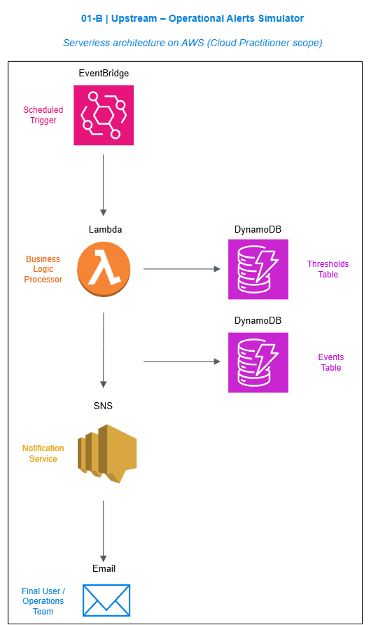

Ingeniero con experiencia en operaciones upstream.  
AWS Certified Cloud Practitioner con interés en la aplicación de tecnologías cloud para optimizar procesos operacionales en el sector energético.

Este repositorio documenta el desarrollo de un sistema de monitoreo operacional serverless como parte de la construcción de un portafolio técnico aplicado a Oil & Gas.

# AWS Upstream Operational Monitoring - 01B

## - DESCRIPCIÓN DEL PROYECTO

Sistema serverless de monitoreo operacional upstream desarrollado en AWS para detectar anomalías en variables críticas de perforación y generar alertas automáticas en tiempo real.

El sistema analiza datos operacionales simulados y los compara contra umbrales configurables almacenados en Amazon DynamoDB. Cuando se detecta una desviación, se registra el evento y se envía una notificación automática mediante Amazon SNS.

Este proyecto fue desarrollado como ejercicio práctico dentro del alcance de la certificación AWS Certified Cloud Practitioner, con enfoque aplicado al sector energético.

## - PROBLEMA QUE RESUELVE

En operaciones upstream, variables como:

    → Rata de Prenetración - ROP (Rate of Penetration)
    → Torque
    → Preión de la Línea - Standpipe Pressure
    → Densidad del Lodo - Mud Density

pueden indicar desviaciones operacionales si se encuentran fuera de los rangos normales o configurados..

En muchos entornos tradicionales, el monitoreo depende de revisión manual o sistemas poco integrados.

Este sistema permite:

Detectar anomalías automáticamente
Registrar eventos para trazabilidad
Generar alertas en tiempo real
Desacoplar procesamiento y notificación
Sentar base para monitoreo remoto escalable

## - ARQUITECTURA DEL SISTEMA

Flujo del sistema:

    → EventBridge
    → AWS Lambda
    → DynamoDB (tabla de umbrales)
    → DynamoDB (tabla de eventos)
    → SNS
    → Notificación por correo electrónico

Arquitectura 100% serverless y orientada a eventos.

Principios aplicados:

Desacoplamiento de servicios
Escalabilidad automática
Bajo costo operativo
Configuración dinámica
Observabilidad mediante logs

## - SERVICIOS DE AWS UTILIZADOS
 
AWS Lambda
Amazon DynamoDB
Amazon SNS
Amazon EventBridge
AWS IAM

## - CARACTERISTICAS TÉCNICAS

Comparación dinámica contra umbrales almacenados en base de datos.
Registro persistente de anomalías.
Generación automática de eventos de alerta.
Arquitectura basada en eventos (event-driven).
Diseño modular y extensible.

## - EJEMPLO DE EVENTO DETECTADO
  
Ejemplo real de alerta generada:

{
"event_id": "1fc48558-cfa6-4dee-8393-20b6739b9489",
"asset_id": "WELL-01",
"variable": "rop",
"measured_value": "35.66",
"severity": "HIGH",
"timestamp": 1771948749,
"max_threshold": "35"
}

## -EVIDENCIA DE EJECUCIÓN REAL

Las siguientes capturas muestran la ejecución automática del sistema cada 5 minutos mediante EventBridge, la persistencia de anomalías en DynamoDB y la recepción de alertas en tiempo real vía SNS.

Las siguientes capturas muestran la validación end-to-end del sistema operando automáticamente en AWS:

- 📧 [Alertas SNS](./evidence/sns)
- 🗄 [Eventos en DynamoDB](./evidence/dynamodb)
- 📊 [Logs de Lambda](./evidence/lambda)
- ⏱ [Programación EventBridge](./evidence/eventbridge)

## - POSIBLES EVOLUCIONES

El sistema puede evolucionar hacia:

Integración con AWS IoT Core para datos en tiempo real
Streaming con Amazon Kinesis
Visualización ejecutiva con Amazon QuickSight
Integración con sistemas SCADA
Arquitectura multi-activo (múltiples pozos o rigs)
Integración con modelos predictivos basados en IA

## - ESTRUCTURA DEL REPOSITORIO

/lambda → Función principal de detección de anomalías

/architecture → Diagrama de arquitectura

/evidence → Evidencias de ejecución

## - CONTEXTO PROFESIONAL

Ingeniero de Petróleo con experiencia en operaciones upstream y gestión corporativa en entornos operacionales críticos.
Actualmente AWS Certified Cloud Practitioner, desarrollando un perfil híbrido que integra conocimiento profundo de procesos operativos reales con competencias en cloud computing e inteligencia artificial.
Interesado en la intersección entre energía y tecnología.

Este proyecto forma parte del desarrollo práctico de soluciones cloud aplicadas a problemáticas reales del sector energético.

## - USO DE HERRAMIENTAS DE ASISTENCIA

El diseño de la arquitectura y la estructuración del código fueron desarrollados como ejercicio práctico de arquitectura serverless en AWS.
Durante el proceso se utilizó asistencia de modelos de lenguaje (LLMs) como herramienta de apoyo para:

Validación de decisiones arquitectónicas
Optimización de estructura de código
Revisión de buenas prácticas
Aceleración del proceso de documentación
La implementación, comprensión y validación funcional del sistema fueron realizadas de forma consciente y orientadas al aprendizaje práctico de los servicios utilizados.

Este proyecto representa la transición estratégica hacia un perfil profesional híbrido energía + tecnología, combinando experiencia operacional real con arquitectura cloud moderna.
